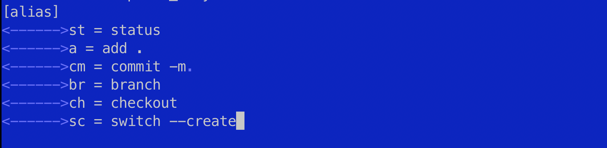

[На главную](/){ .md-button }
##

# Git. Основные команды. Настройка alias


---

## #Настроим alias для команд git

=== "Mac / Linux"
        
    ### откройте терминал
    перейдите в вашу домашнюю директорию с помощью команды `cd ~`. Настраиваем локально на своем компьютере
    ```
    cd ~

    ```

    ### проверьте наличие файла .gitconfig с помощью команды:
    ```
    ls -a
    ```
    

    ### если файл уже существует, переходите к следующему шагу. Если файла нет, создайте его с помощью текстового редактора, например:
    ```
    touch .gitconfig
    ```

    ### откройте файл .gitconfig для редактирования с помощью текстового редактора, например:
    ```
    nano .gitconfig
    ```
    ```
    mcedit .gitconfig
    ```

    ### добавьте указанные алиасы для Git в файл .gitconfig:
    придумайте свои варианты
    ```
    [alias]
    st = status
    a = add .
    cm = commit -m
    br = branch
    ch = checkout
    sc = switch --create
    ```

    ### сохраните и закройте файл 
    1. в Nano это можно сделать нажатием Ctrl + O, затем Enter 
    2. и Ctrl + X для выхода

    ### теперь вы можете по новому использовать часто использумые команды

    * `git st` - git status
    * `git a` - git add .
    * `git cm 'my description'` - git commit -m 'my description'

=== "Windows"
    
    - для пользователей Windows последовательность шагов следующая:
    - Откройте проводник Windows
    - Перейдите в вашу домашнюю директорию. Обычно это `C:\Users\Ваше_имя_пользователя\`
    - Убедитесь, что отображаются скрытые файлы и папки. Для этого выберите "Вид" в верхнем меню проводника и поставьте галочку напротив "Скрытые элементы"
    - Найдите файл .gitconfig в вашей домашней директории
    - Откройте файл .gitconfig с помощью текстового редактора, например, блокнота
    - Добавьте указанные алиасы для Git в файл .gitconfig:

    

 

    ### добавьте указанные алиасы для Git в файл .gitconfig:
    придумайте свои варианты
    ```
    [alias]
    st = status
    a = add .
    cm = commit -m
    br = branch
    ch = checkout
    sc = switch --create
    ```

    - Сохраните изменения в файле .gitconfig

    ### теперь вы можете по новому использовать часто использумые команды

    * `git st` - git status
    * `git a` - git add .
    * `git cm 'my description'` - git commit -m 'my description'

---
## #Commands git

###инициализация нового репозитория
```
git init
```

### склонировать удалённый репозиторий 
```
git clone [ссылка на удалённый репозиторий]
```

* `например`
```
git clone git@github.com:tailwindlabs/tailwindcss.git
```


### посмотреть статус файлов
показывает состояния файлов в рабочем каталоге и индексе: какие файлы изменены, но не добавлены в индекс
```
git status
```

### добавляем файлы
```
git add .
```

### делаем коммит, фиксирует изменения
```
git commit -m 'type your comment for commit'
```

* `например`
```
git commit -m 'fixed slider, created about page'
```

### отправка изменений в удаленный репозиторий
```
git push
```

### получение изменений из удаленного репозитория
```
git pull
```

### просмотр истории коммитов
```
git log
```

### cоздать ветку (1 - вариант)
Добавляет новую ветку с названием branch-name и автоматически переключает на неё
```
git switch --create branch-name
```

* `например`
```
git switch --create dev
```

### создание новой ветки (2 - вариант)
и переключение на нее одновременно. Начиная с Git версии 2.23, рекомендуется использовать git switch
```
git checkout -b new-feature
```

* `например`
```
git checkout -b dev
```

### переключить ветку
Вы перейдёте на уже созданную ветку branch-name
```
git switch branch-name
```

### слияние указанной ветки с текущей
переключаемся например `git checkout dev` -
Вливает ветку new-feature в ветку, в которой вы находитесь `ветка dev`
```
git merge new-feature
```


### удаление указанной ветки (безопасное удаление, если нет неслитых изменений). Например:
```
git branch -d new-feature
```

### принудительное удаление указанной ветки, даже если есть неслитые изменения. Например:
```
git branch -D new-feature
```


### отложить изменения
```
git stash push
```


### вернуть отложенные изменения
```
git stash pop
```

### удалить лишнее. Команда «наводит чистоту» — удаляет неотслеживаемые файлы из рабочего каталога
```
git clean
```


### посмотреть все локальные ветки 
```
git branch
```
    


